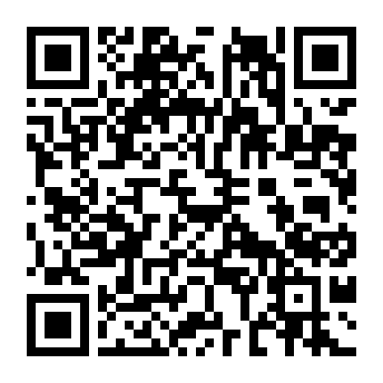
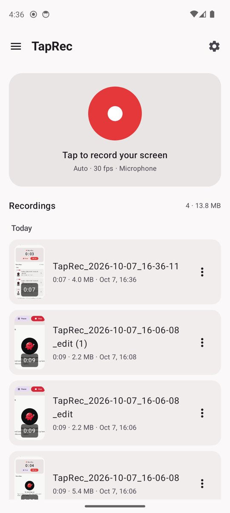
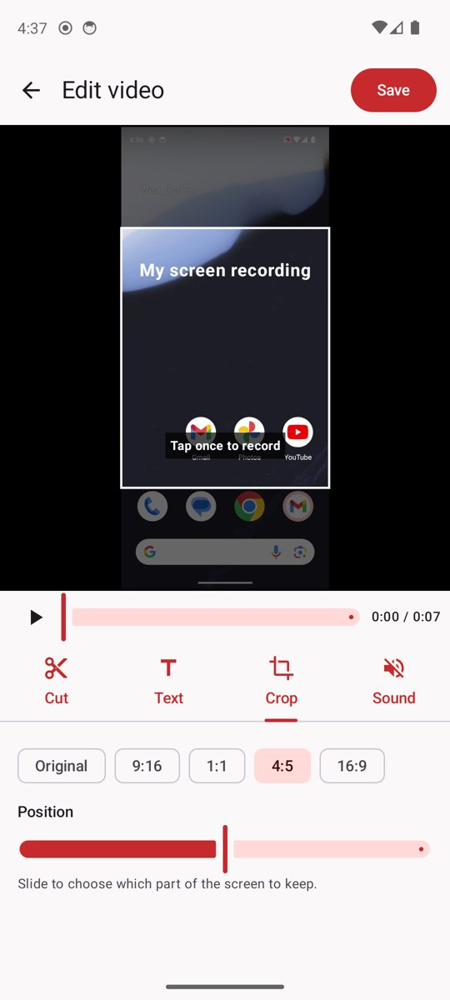
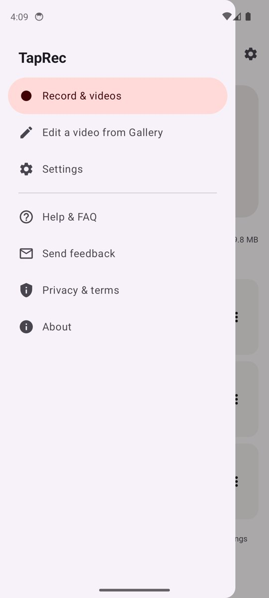

<h1 align="center">TapRec</h1>

<b>Screen recorder for Android — one tap, with sound, plus a simple editor.</b> 
Free · no account · no ads · your videos never leave your phone

  <a href="https://github.com/nvminhtu/taprec/releases/latest/download/TapRec-android.apk"><b>⬇ Download for Android (APK, 4.9 MB)</b></a>

 
Scan with your phone's camera to download

  
  
  

## What it does

- **Record the screen** in one tap, with a 3‑2‑1 countdown. Up to your screen's full resolution, 24/30/60 fps.
- **Sound:** microphone, the phone's own sound (Android 10+), or both.
- **Pause and resume** — still one video, no gap.
- **Control it from anywhere:** floating button over other apps, or the notification.
- **Your videos:** grouped by day, play, share, rename, delete one or many. Saved to **Movies › TapRec** so they also show in Gallery.
- **Edit:** cut the start/end, remove a part in the middle, mute, add a title or captions, crop to 9:16 · 1:1 · 4:5 · 16:9. Every edit is saved as a new copy — the original is never changed.

## Install

Requires **Android 10 or later**.

1. On your phone, tap the **Download** link above (or scan the QR code).
2. Open **TapRec-android.apk** from the notification or the **Downloads** folder.
3. If Android says *"For your security, your phone is not allowed to install unknown apps from this source"*,
   tap **Settings**, turn on **Allow from this source**, then go back and tap **Install**.
4. If Play Protect asks about an unrecognised app, tap **More details → Install anyway**.
   TapRec isn't on Google Play yet, so Play Protect doesn't know it.
5. Open **TapRec**, tap the red button, and allow **Start now** when Android asks to record the screen.

**Updating:** download the new APK and install it over the old one — your videos and settings stay.

## Privacy

No account, no analytics, no ads, no internet access needed for recording. Recordings are stored only on your
phone and leave it only when you share them yourself.

| Permission | Why |
|---|---|
| Screen capture | to record the screen — Android asks every time |
| Microphone | to record sound (also needed for the phone's own sound) |
| Notifications | recording controls |
| Display over other apps | only if you turn on the floating button |

## Versions

The download link always gives you the newest version. Older versions and checksums (`SHA256SUMS.txt`):
[Releases](https://github.com/nvminhtu/taprec/releases).
